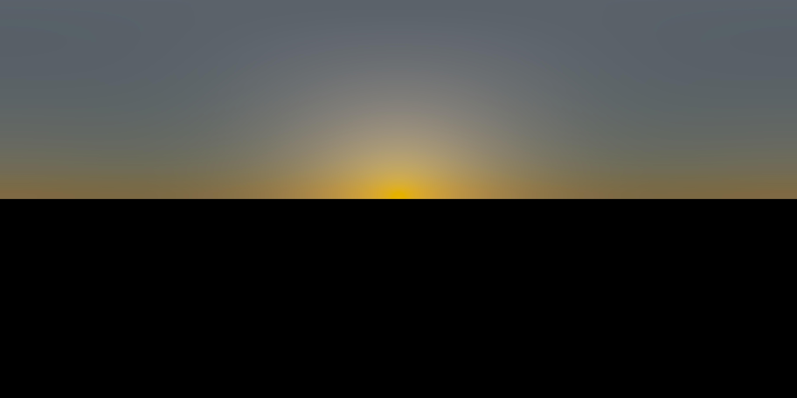

# SkySim

Basic sky simulation built with physical accuracy in mind

    
    <a href="https://panoraven.com/en/embed/TcZGdmp79N">View in 360°!</a>
</p

## Instructions

1. Run the command `python simulate.py` in your terminal.
2. Open the generated `sky.jpeg` in one of the supported viewers.

## Supported viewers

* https://panoraven.com
* https://photo-sphere-viewer.js.org/playground.html

## Sky models

**Perez All-Weather**

All-weather model for sky luminance distribution—Preliminary configuration and validation, Perez et al., Solar Energy (vol. 50, issue 3), 1993

**Preetham**

A practical analytic model for daylight, Preetham et al., Proceedings of the 26th annual conference on Computer graphics and interactive techniques (SIGGRAPH '99), 1999

## Formula

The formula used in the simulation are reported [here](notes.pdf).

## TODO

* [ ] Make a proper command-line interface
* [ ] Use a better scale for the final dynamic range
* [ ] Compute the position of the sun from time and location
* [ ] Make an interactive viewer
* [ ] Add more popular sky models
